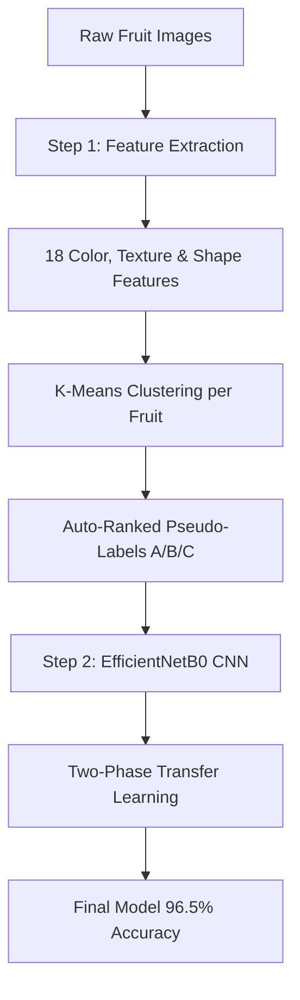

# Automated Fruit Quality Grading System

A computer vision project implementing an automated, two-stage machine learning pipeline for grading fresh fruit quality (Apples, Oranges, Bananas) into grades **A** (Premium), **B** (Average), and **C** (Low). 

This project explores a **"cluster-then-classify" (pseudo-labeling)** methodology to eliminate manual annotation effort, scaling to thousands of images without human label bias.

---

## Key Results & Performance
Our best-performing model (trained via two-phase transfer learning on EfficientNetB0) achieved the following results on the test set:

* **96.5% overall test accuracy** and **0.96 macro F1-score** across 9 classes (3 fruits × 3 quality grades).
* **Perfect Grade Separation**: Zero cross-fruit confusion (e.g., the model never mistakes an orange for an apple).
* **Premium Quality Detection**: **100% recall** on Banana and Orange Grade A classes, and **93%** on Apple Grade A.
* **Banana Grading Strength**: The strongest category overall, yielding **96% to 100% per-grade F1-scores**.
* **Fragile Class Handling (Orange C)**: With only **123 images total** (18 in the test set), this minority class was highly sensitive. Applying a class weight of **5.3x** helped stabilize training, achieving an F1-score of **0.86** and precision of **0.75**.

---

## How It Works (The 2-Stage Pipeline)



### Stage 1: Unsupervised Pseudo-Labeling (`Step 1 Notebook`)
1. **Feature Extraction**: Extracts 18 visual descriptors per image covering **Color** (e.g., Hue/Saturation/Value means & spread), **Texture** via Gray-Level Co-occurrence Matrix (GLCM), and **Shape/Surface** (Blemish ratio, Edge density, Roundness).
2. **K-Means Clustering**: Grouping is performed *per fruit type* to prevent K-Means from clustering by fruit species instead of quality.
3. **Auto-Grade Assignment**: Clusters are ranked using a custom quality score based on brightness, saturation, color uniformity, texture homogeneity, blemish ratio, and edge density.
4. **Boundary Detection**: Identifies borderline samples using a custom boundary score. Apple features had **9.8% borderline samples** (score > 0.85) and Banana had **10.4%**, explaining the Grade B ambiguity inherited by the CNN.

### Stage 2: Supervised CNN Classification (`Step 2 Notebook`)
1. **Model Backbone**: Pretrained EfficientNetB0 with custom classification heads.
2. **Phase 1 Training (Frozen Base)**: Trains only the classification head for 15 epochs at `LR=1e-3` to preserve ImageNet features.
3. **Phase 2 Training (Fine-Tuning)**: Partially unfreezes the top 20 layers for 30 epochs at `LR=1e-4` for domain adaptation.
4. **No Phase 3 (The Noise Ceiling)**: Unfreezing the entire network (Phase 3) caused the test set accuracy to collapse to **15%** (while validation accuracy on the noisy pseudo-labels artificially hovered around **85–88%**). This occurred because the network began memorizing the K-Means pseudo-label noise (estimated at **~15–20%**) instead of learning true quality features. Removing Phase 3 was the critical fix.

---

## Repository Structure

* `fruit_grading_step1_kmeans_v2.ipynb`: Unsupervised feature extraction, K-Means clustering, and boundary analysis.
* `fruit_grading_step2_cnn_final.ipynb`: Data pipeline, two-phase transfer learning, and Grad-CAM/confusion matrix evaluation.
* `output/`: Folder containing model evaluation reports, plots, and boundary metrics.
  * `plots/confusion_matrix_v4.png`: Best model's confusion matrix.
  * `plots/per_class_accuracy_v4.png`: Accuracy heatmap for all 9 classes.
  * `plots/boundary_scores.png`: Distribution of borderline sample scores.
  * `plots/training_curves_v4.png`: Visual showing the Phase 3 accuracy collapse.
* `v1/` & `v2/`: Experimental history containing intermediate notebook versions.
* `download_dataset_kaggle.ipynb`: Helper notebook to fetch the raw Kaggle dataset.

---

## Setup & Execution

### Prerequisites & Dependencies
Install the required Python packages:
```bash
pip install tensorflow opencv-python scikit-learn scikit-image pandas tqdm matplotlib
```

### Running the Project
1. **Download Dataset**: Use `download_dataset_kaggle.ipynb` to download the Kaggle fresh fruits dataset, or manually place it into a `dataset/` directory structured as:
   ```text
   dataset/
   ├── train/
   │   ├── freshapples/
   │   ├── freshoranges/
   │   └── freshbananas/
   └── test/
       └── ...
   ```
2. **Generate Pseudo-Labels**: Run `fruit_grading_step1_kmeans_v2.ipynb` to extract features, perform clustering, and save `output/labeled_dataset.csv`.
3. **Train the CNN**: Run `fruit_grading_step2_cnn_final.ipynb` to train the EfficientNetB0 classifier on the generated pseudo-labels.

---

## Limitations
* **Label Quality Ceiling**: Because labels are derived from K-Means clustering and not human experts, the model learns what K-Means defines as "quality." It is a grading system relative to this dataset's distribution, not a strict agricultural standard.
* **Middle Class Ambiguity**: While Grade B performance improved significantly in v4 (>94% F1-scores), borderline samples still inherently inherit the highest label uncertainty from the K-Means pseudo-labeling phase.
